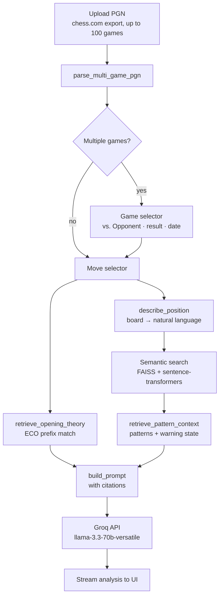

# chess_rag

> Upload a chess game, pick a move, get AI analysis that explains WHY — citing opening theory, naming the pattern, grounded in real chess knowledge.

Stockfish tells you "Nf6 was better (+0.5)." This tells you *why* and what pattern you walked into.

**[Live demo →](#)** *(link after HF Spaces deploy)*

## How it works



## RAG pipeline

1. **Retrieve** — ECO opening theory (dict prefix match on SAN moves) + tactical pattern retrieval context (`patterns` plus a `warning` when the retrieval system is unavailable)
2. **Augment** — inject retrieved context into the prompt before the LLM sees it
3. **Generate** — Groq streams the analysis, citing the retrieved sources

The retrieval functions are named and structured so the agentic architecture is readable:

```python
openings = retrieve_opening_theory(moves[:ply])        # ECO: what opening is this?
context  = retrieve_pattern_context(board)             # patterns.md: matches + retrieval warning
patterns = context["patterns"]
prompt   = build_prompt(openings, patterns, board, moves)
response = call_groq(prompt)
```

## Run locally

```bash
git clone <repo>
cd chess_rag
uv sync                          # installs all deps (Python 3.11, managed by uv)
uv run python -m rag.ingestion   # build the pattern index (run once)
cp .env.example .env             # add GROQ_API_KEY only if you want live Groq commentary
uv run streamlit run app.py      # works with or without an API key (fallback mode available)
```

If `data/chess_index.faiss` or `data/chess_patterns.json` is missing, the app now stays usable: it shows opening theory, skips pattern matches, and surfaces a warning telling you to rebuild the index.

If the vector artifacts exist but model/index loading fails for some other reason, the app also stays usable: it labels pattern retrieval as temporarily unavailable instead of pretending there was simply “no pattern match.”

## Operational behavior

- **No `GROQ_API_KEY`**: the app still works and falls back to deterministic local commentary.
- **Missing / empty / invalid FAISS artifacts**: the UI warns that the pattern index must be rebuilt with `uv run python -m rag.ingestion`.
- **Pattern retrieval runtime failure**: the UI warns that retrieval is unavailable right now, while opening lookup and fallback commentary still work.
- **True no-match case**: the UI shows `No pattern match` *without* a warning, so “no match” is distinct from “retrieval system broken.”

## Demo with the bundled sample PGN

If you want to sanity-check the full pipeline without exporting your own game yet, open `examples/sample_game.pgn`.
It contains two short games that exercise:

- multi-game parsing
- game selection
- move selection
- opening lookup
- pattern retrieval
- local fallback commentary when `GROQ_API_KEY` is missing

The sample file is also used by the test suite as a smoke check.

## Run tests

```bash
uv run pytest                              # all tests
uv run pytest -m "not requires_index"     # skip index-dependent tests
```

## Stack

- The project uses `pyproject.toml` for ranges and `uv.lock` for exact pinned dependency versions.

| Layer | Tech |
|---|---|
| Frontend | Streamlit |
| Pattern retrieval | sentence-transformers + FAISS cosine similarity |
| Opening lookup | ECO database (dict prefix match, zero ML) |
| LLM | Groq free tier (llama-3.3-70b-versatile, 14,400 req/day) |
| PGN parsing | python-chess |
| Hosting | Hugging Face Spaces (free CPU tier) |
| Deps | uv |

## Knowledge base

- **ECO openings** — ~100 opening codes with move sequences (public domain, from lichess-org/eco)
- **Chess patterns** — 53 annotated pattern descriptions (Greek Gift, Back Rank Mate, Isolated Queen Pawn, etc.) — each ~200 words covering position indicators, strategic idea, and example line

## Why not Stockfish?

Stockfish gives you evaluation numbers. This gives you *explanations*. "Your bishop on c4 targets the f7 pawn, a weakness in the Italian Game — this is the Italian Attack setup" is not something any engine can say. RAG makes it possible.
